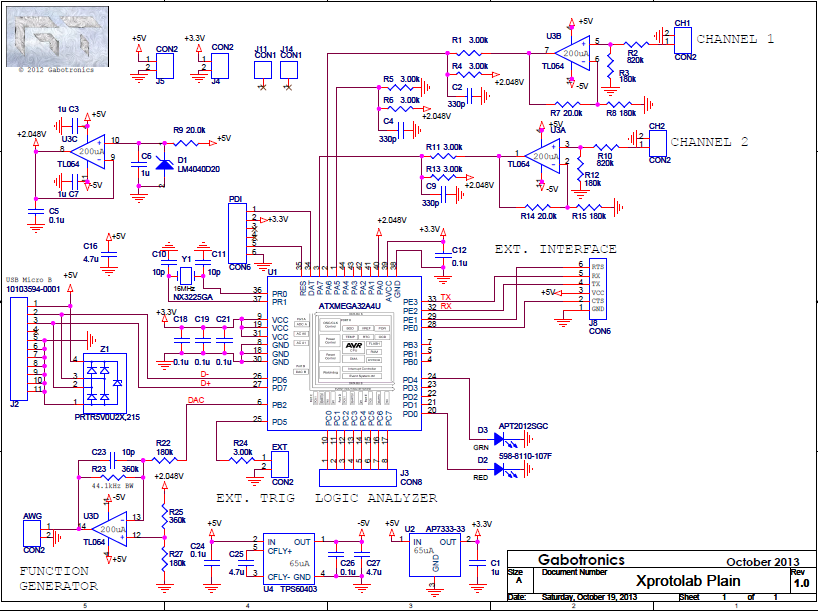
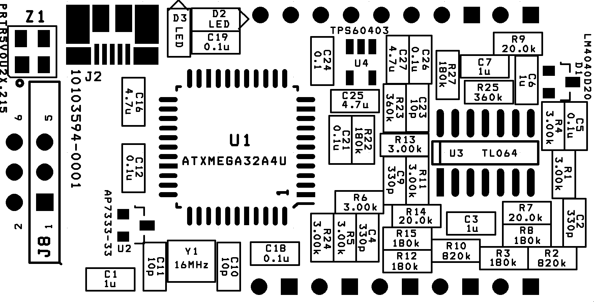

# Mini-Osciloscopio

## 📚 Descripción
Implementación del **Mini Osciloscopio Xprotolab Plain** diseñado por [Gabotronics](https://www.gabotronics.com/categories/products/xprotolab-plain.html).  

Este proyecto fue realizado como parte del curso *Taller de Equipos Electrónicos (EC3083)* en la *Universidad Simón Bolívar*, utilizando un kit donado por **Gabotronics**. 

El proyecto consistió en: 
- ✅ Ensamblaje del circuito (soldadura de componentes SMD/THT).  
- ✅ Pruebas de funcionamiento.  
- ✅ Experimentación con diferentes señales.
- ✅ Visualización de las señales en PC mediante software dedicado.

## 🛠️ Tecnologías
- **Hardware**: PCB y componentes proporcionados por Gabotronics. 
    - [BOM](https://www.gabotronics.com/download/xproto-plain/xprotolab-plain-bom.xlsx). 
- **Software**: 
    - [XScopes PC Interface](https://www.gabotronics.com/product-info/xprotolab-pc-interface.html).
    - Driver WinUSB [ZADIG tool](https://www.gabotronics.com/download/xscopes/zadig_v2.0.1.162.exe).

## 📸 Media

### ⚡ PCB
Foto PCB soldada, por adelante y atras
Foto del Kit?

### 📐 Esquemático/Footprints

*Esquemático del osciloscopio*

*Footprints para ensamblaje del osciloscopio*

### 📊 Visualización de señales
Señales capturadas en el software (ej. onda cuadrada, senoidal, etc).  

## ⚠️ Disclaimer  
- **Diseño original**: Propiedad de [Gabotronics](https://www.gabotronics.com/). Este repositorio 
documenta la implementación de su kit donado. 
- **Propósito**: Fines educativos y de portafolio personal. **No comercial**.   
- **Documentación técnica oficial**: Disponible en la [página de Gabotronics](https://www.gabotronics.com/categories/products/xprotolab-plain.html).
- **Licencia**: El diseño, firmware y el software para la visualización son propiedad intelectual de Gabotronics. 